# 🌍 AltAir - Frontend Repository

[English Version](README.md) | [简体中文](README-zh.md)

---

<div align="center">
  
</div>

---

## 🚀 **Introduction**
**AltAir** originated from the primary practical training course of the School of Software Engineering of Sun Yat-sen University and was developed by the **[Terminal Terrace Team](https://github.com/Terminal-Terrace)**. This a **QML-based frontend project** designed for efficient and intuitive user interaction. The system supports both **user** and **administrator** functionalities, including:
- **Flight search and filtering**.
- **Order management**.
- **Personal center**.
- **Travel notes display**.

---

## 🖂 **Project Structure**
```plaintext
├── components/              # Reusable components
├── views/                   # Feature pages
├── figures/                 # Static resources
├── api/                     # Utility modules
├── storage/				 # Global variables
├── Main.qml                 # Application entry point
└── README.md                # Project documentation
```

---

## ✨ **Features**

### User Side
- 🔎 **Flight Search**: Real-time search and filtering by time, city, or price.
- 📋 **Order Management**: View, filter, and manage orders; support for refunds and rescheduling.
- 🌟 **Personal Center**: Manage profile information and favorite flights.
- 🗒 **Travel Notes**: Discover and interact with travel notes and guides.

### Admin Side
- 🛨 **Flight Management**: Add, edit, and delete flight data with real-time updates.
- 👥 **User Management**: View and manage user accounts.

---

## ⚙️ **Development Environment**

| Requirement          | Details |
| -------------------- | ------- |
| **Qt Version**       | 6.5.3   |
| **Build Tool**       | CMake   |
| **Operating System** | Windows |

---

## 🛠️ **Getting Started**

### 1. Clone the Repository
```bash
git clone git@github.com:Jerrylingj/Flight-Management-System-Client.git
```

### 2. Build and Run
```bash
mkdir build && cd build
cmake ..
cmake --build .
```

---

## 📋 **Screenshots**
<div align="center">
  
  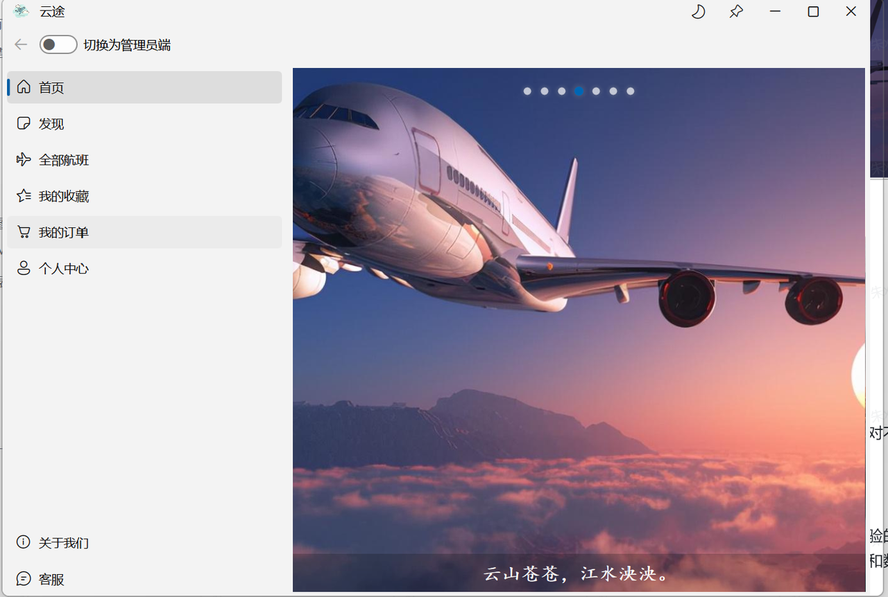
</div>

<div align="center">
  
  
</div>

<div align="center">
  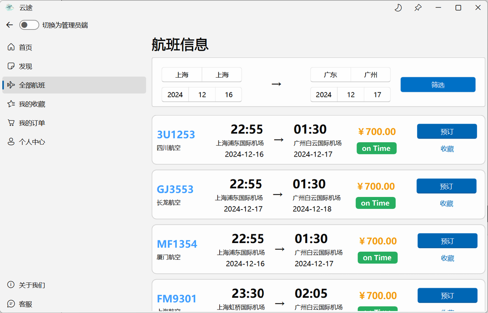
  
</div>

<div align="center">
  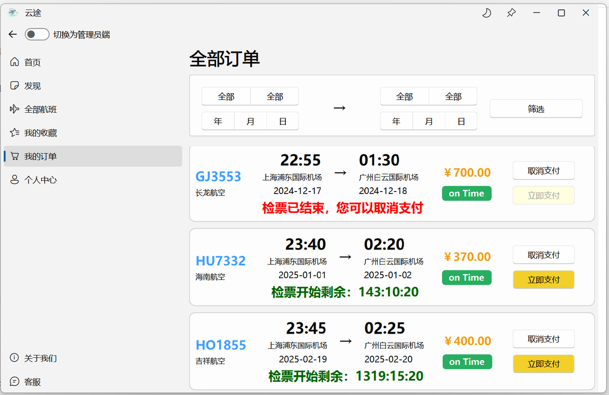
  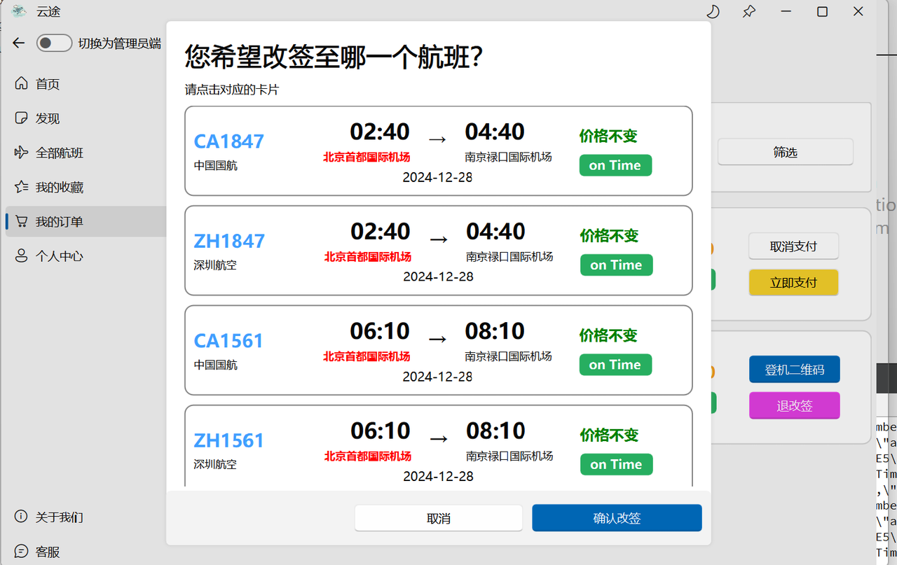
</div>

<div align="center">
  
  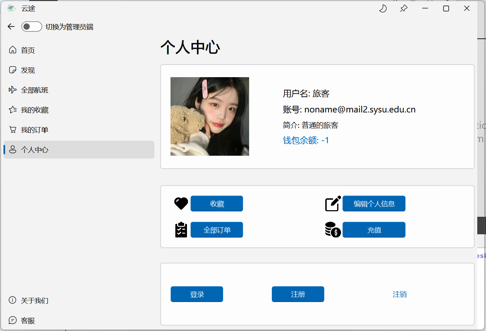
</div>

<div align="center">
  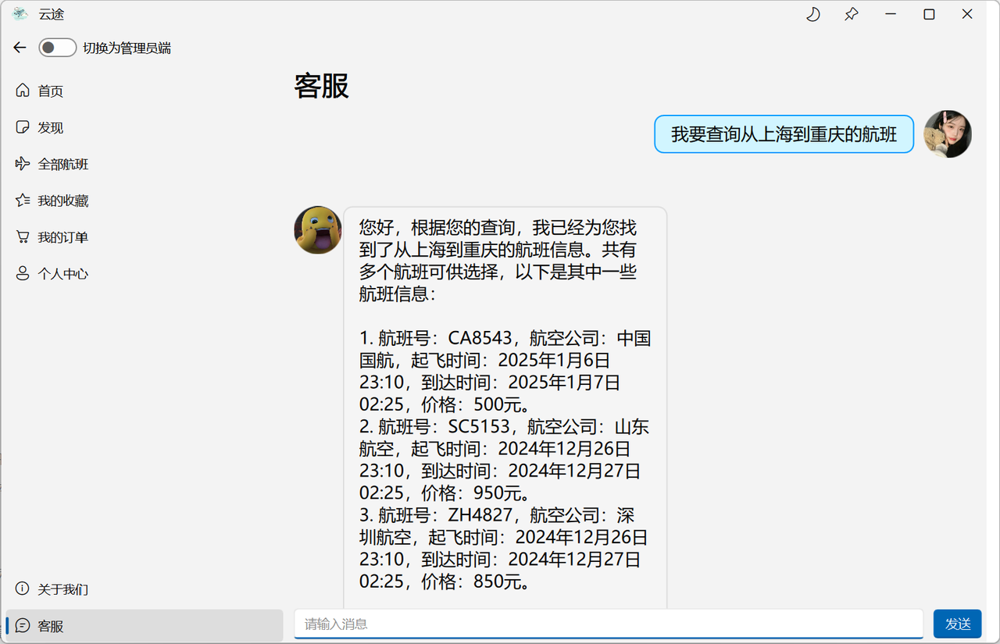
  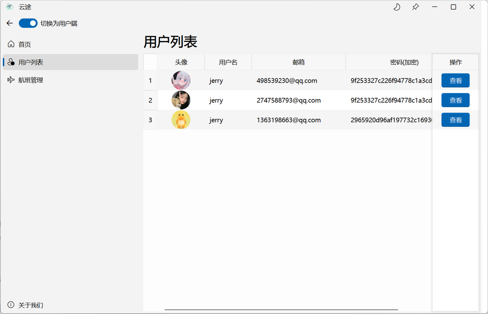
</div>

<div align="center">
  
  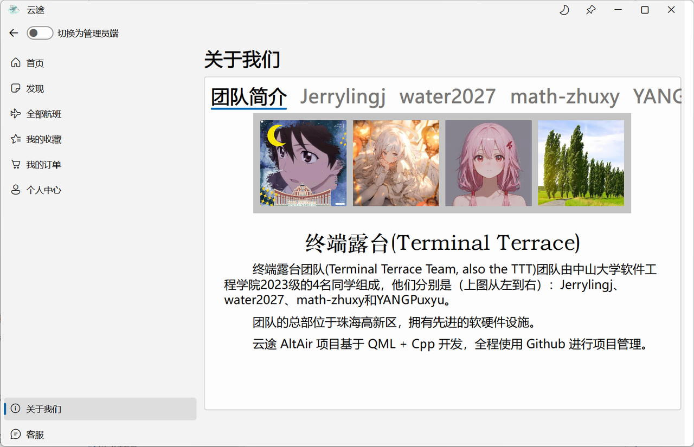
</div>

<div align="center">
  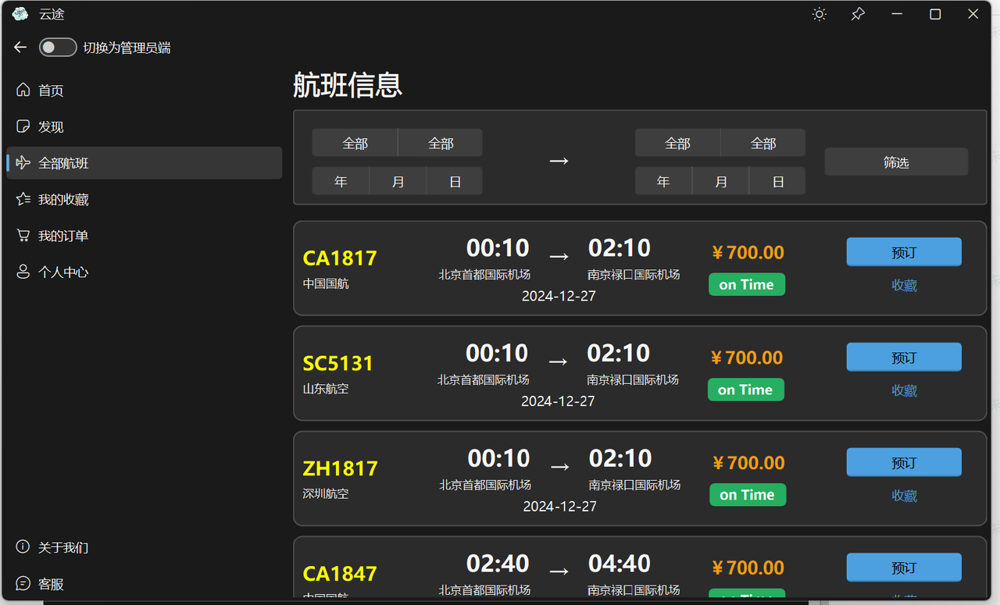
  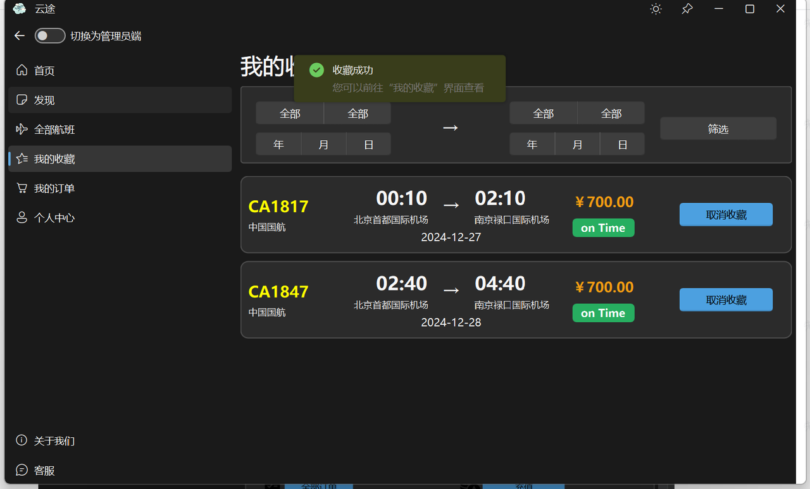
</div>

<div align="center">
  
  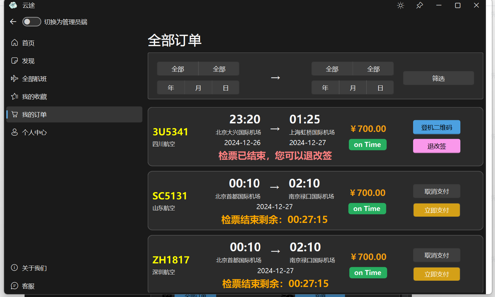
</div>

<div align="center">
  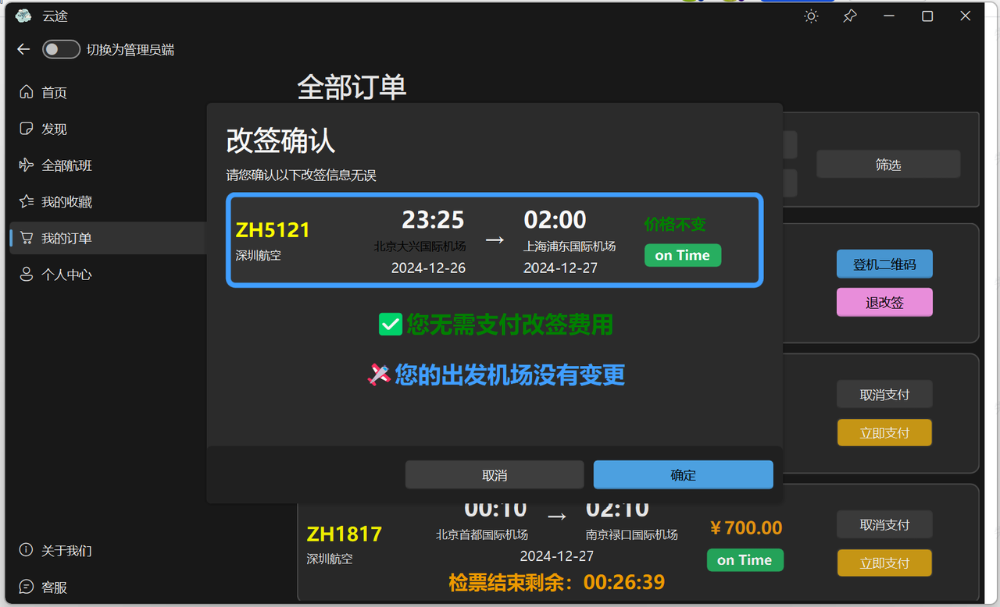
  
</div>

---

## 🤝 **Contributions**

We welcome contributions from everyone! Follow these steps:
1. Fork the repository.
2. Create a feature branch: `git checkout -b feature-name`.
3. Commit your changes: `git commit -m "Add feature-name"`.
4. Push to the branch: `git push origin feature-name`.
5. Create a pull request.

---

## 📞 **Contact**

For questions or suggestions, please contact:
- **Jerrylingj**：lingj28@mail2.sysu.edu.cn
- **water2027**：linshy76@mail2.sysu.edu.cn
- **math-zhuxy**：zhuxy255@mail2.sysu.edu.cn

- **YANGPuxyu**：yangpx26@mail2.sysu.edu.cn

---

## ⚡ **Future Plans**

### Short-Term Goals
- Complete front-end UI/UX enhancements.
- Implement detailed error handling for all user actions.

### Long-Term Goals
- Integrate AI-based flight recommendations for users.
- Add multi-language support for global users.
- Explore mobile platform compatibility with Android/iOS.

---

<div align="center">
  <p>&copy; 2024 AltAir. All Rights Reserved.</p>
</div>
